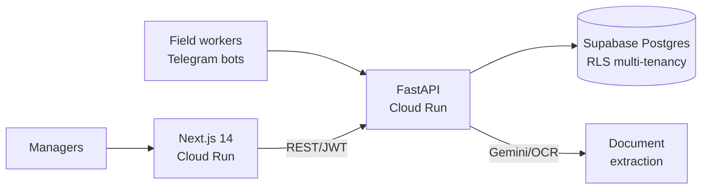

# SurenSaaS

[](https://nextjs.org/)
[](https://fastapi.tiangolo.com/)
[](https://supabase.com/)
[](https://cloud.google.com/run)
[](https://telegram.org/)

> Production multi-tenant SaaS for small businesses (construction, cleaning, energy diagnostics) — built around real field operations, not a demo.

**SurenSaaS** is a real-world SaaS developed for an actual SMB: construction
crews record invoices on the go via **Telegram bots**, the backend extracts
data with **Gemini/OCR**, managers accept/reject and track everything from a
**multi-tenant web backoffice**. Built with a two-environment deployment
(TEST + PROD) on GCP Cloud Run and Supabase Postgres.

## ✨ Features

- **Multi-tenancy done properly** — org-based routing (`/[org]/...`) front and back + PostgreSQL Row-Level Security isolation of every org's data
- **Field access via Telegram bots** — one bot per business vertical (construction, cleaning, energy-audit), using workers' Telegram identity as the entry point into the backoffice
- **AI document extraction** — Gemini-based agent (with OCR fallback) turns photos of invoices/reports into structured data
- **Contract-first API** — OpenAPI contract generates the backend controllers; front and bots always match the API
- **Safe dual environments** — TEST and PROD Cloud Run services, shared Supabase database isolated by `org_id`
- **Hardened perimeter** — strict CORS whitelist, JWT validation, GCP Secret Manager only

## 🏗️ Architecture



## 🧰 Stack

| Service | Tech | Deployment |
|---|---|---|
| Frontend | Next.js 14 (App Router) + TypeScript + Tailwind | Cloud Run |
| Backend | FastAPI (Python) | Cloud Run (scale-to-zero) |
| Database | Supabase Postgres + RLS | Supabase Cloud |
| Auth | Email/password with pre-authorization | JWT end-to-end |
| Bots | Telegram | via backend |

*(Developed with a French SMB — the product is in production; key docs are translated to English, operational docs in French.)*

## 🚀 Quick Start

Full operational guide → [`docs/DEPLOYMENT.md`](docs/DEPLOYMENT.md) ⭐

```bash
# Check configuration
./scripts/check-config.sh

# Run locally (backend :8080 / frontend :3000)
./scripts/run-local-back_test.sh     # terminal 1
./scripts/run-local-front_test.sh    # terminal 2

# Deploy TEST then PROD
./scripts/deploy_back_test.sh && ./scripts/deploy_front_test.sh
./scripts/deploy_back_prod.sh && ./scripts/deploy_front_prod.sh

# Watch the logs
gcloud logging tail --service=test-surensaas-back
```

Secrets are read from environment variables
(`TEST_SUPABASE_SERVICE_KEY`, `TEST_JWT_SECRET`, bot tokens…); see
[`.env.example`](.env.example).

## 📂 Project structure

```
.
├── docs/                  # Technical documentation (see index below)
├── db/schema + policies   # SQL: tables, RLS policies
├── openapi/               # OpenAPI contract
├── scripts/               # Config-check / run / deploy scripts (test & prod)
├── surenSaasFront/        # Next.js frontend
└── surenSaasBack/         # FastAPI backend
```

## 📖 Documentation index

| Topic | Doc |
|---|---|
| ⭐ Deployment TEST/PROD | [DEPLOYMENT.md](docs/DEPLOYMENT.md) |
| Architecture | [ARCHITECTURE.md](docs/ARCHITECTURE.md) |
| Multi-tenancy | [MULTITENANCY.md](docs/MULTITENANCY.md) |
| Authentication | [AUTHENTICATION.md](docs/AUTHENTICATION.md) |
| Database | [DATABASE.md](docs/DATABASE.md) |
| Telegram bots | [TELEGRAM_BOT.md](docs/TELEGRAM_BOT.md) · [telegram-construction-bot.md](docs/telegram-construction-bot.md) |
| Gemini extraction | [gemini-extraction-agent.md](docs/gemini-extraction-agent.md) |
| Security & capabilities | [CAPABILITIES.md](docs/CAPABILITIES.md) · [TODO-securite-capabilities.md](docs/TODO-securite-capabilities.md) |
| Infrastructure | [INFRASTRUCTURE.md](docs/INFRASTRUCTURE.md) |
| Conventions & decisions | [CONVENTIONS.md](docs/CONVENTIONS.md) · [DECISIONS.md (backend)](surenSaasBack/docs/DECISIONS.md) |
| Frontend | [FRONTEND.md](docs/FRONTEND.md) · [frontend decisions](surenSaasFront/docs/DECISIONS.md) |
| Testing | [API contract tests](surenSaasBack/tests/TESTS.md) · [bot tests](docs/tests-telegram-bot.md) · [e2e scenarios](surenSaasFront/e2e/SCENARIOS.md) |
