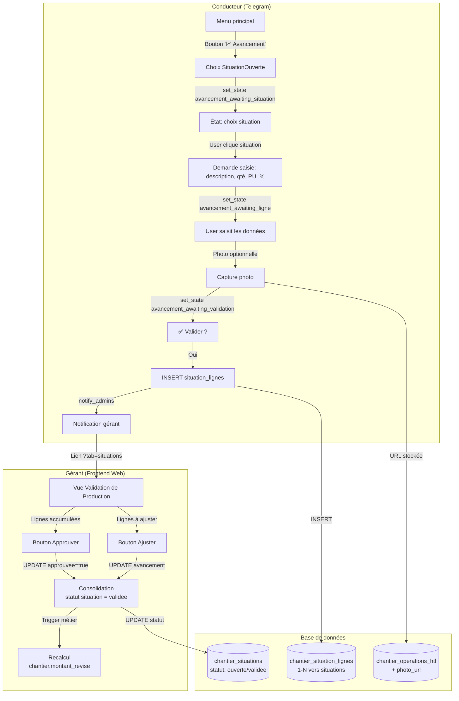

# Bot Telegram Construction — Documentation Complète

## 1. Vue d'ensemble

Le bot Telegram Construction permet aux conducteurs de travaux de signaler des opérations terrain, pointer la présence des ressources, gérer les dépenses, consulter les situations/factures, et uploader des factures fournisseurs — le tout depuis Telegram.

**Architecture :** Webhook Telegram → `telegram_core.py` (router) → dispatcher (message/callback) → handler métier → Supabase/PostgreSQL.  
**Backend :** FastAPI multi-workers (8 workers Uvicorn).  
**Frontend :** Next.js — les données remontent via les 40 routes REST de `app/api/chantiers.py`.

---

## 2. Arborescence des fichiers

```
surenSaasBack/app/api/
├── telegram_core.py                   # Router webhook + helpers API Telegram
├── bot_construction.py                # Dispatch messages + upload facture OCR
├── bot_construction_commands.py       # Dispatcher callbacks + navigation
├── bot_construction_operations.py     # Opérations HITL (création, liste, validation)
├── bot_construction_pointages.py      # Pointages (sélection date, toggle, validation)
├── bot_construction_taches.py         # Tâches (liste par statut, marquer faite)
├── bot_construction_depenses.py       # Dépenses (choix type, création, consultation)
├── bot_construction_invoices.py       # Factures/Situations (validation, annulation, liste)

surenSaasBack/app/services/telegram/
├── base_workflow.py                   # Moteur générique Workflow (extraction → validation → save)
├── construction_menu.py               # Menus + CALLBACK_ROUTES
├── chantier_context.py                # State machine : set_state/get_state sur telegram_users
├── notification_service.py            # notify_admins() générique pour les gérants
├── audit_service.py                   # Audit trail des interactions
├── upload_invoice/service.py          # OCR + création facture brouillon
└── bots_registry.py                   # Registre des bots disponibles

surenSaasBack/app/api/chantiers.py      # 40 routes REST (module chantier)
surenSaasBack/tests/test_telegram_construction_bot.py  # 41 tests unitaires
```

---

## 3. Menu principal du bot

```
📋 Menu principal                          callback_data
├── 📸 Signaler une opération          →  menu:sub:operations
├── 👷‍♂️ Pointer présence               →  menu:sub:pointages
├── 📄 Opérations                      →  op:list:pending
├── 📋 Mes tâches                      →  menu:sub:taches
├── 📄 Situations/Factures             →  menu:sub:situations
├── 💵 Dépenses                        →  menu:sub:depenses
├── 📊 Indicateurs                     →  stats:show
├── 🏗️ Changer de chantier            →  chantier:list
└── ❓ Aide                            →  menu:help
```

### Sous-menus

| Sous-menu | Callbacks | Description |
|-----------|-----------|-------------|
| Opérations | `op:create:{type}` (7 types) | Démolition, Nettoyage, Pose BSO, Commande, Achat matériel, Sous-traitance, Autre |
| Pointages | `pointage:date:today/j-1/j-2` | Sélection de date (Aujourd'hui, J-1, J-2), puis Ressources Humaines / Machines |
| Tâches | `tache:list:{statut}`, `tache:ask_done` | En attente, En cours, Terminées, Marquer comme faite |
| Situations | `service:invoice_upload`, `situation:list` | Upload facture, Voir situations |
| Dépenses | `depense:create`, `depense:list:month` | Signaler dépense, Voir dépenses du mois |

---

## 4. Machine d'état (State Machine)

Stockée dans `telegram_users.last_state` (TEXT) et `telegram_users.last_state_data` (JSONB).

| État | Déclencheur | Action suivante | Table cible |
|------|-------------|----------------|-------------|
| `idle` | Menu principal / `/start` | — | — |
| `op_awaiting_description` | Clic "Signaler opération" (choix type) | User envoie description → `handle_operation_media()` | `chantier_operations_htl` |
| `op_awaiting_validation` | Saisie description opération | User clique ✅ Valider → `handle_save_operation()` | `chantier_operations_htl` |
| `depense_awaiting_description` | Clic type dépense | User envoie description → `handle_depense_media()` | `chantier_depenses` |
| `depense_awaiting_validation` | Saisie description dépense | User clique ✅ Valider → `handle_save_depense()` | `chantier_depenses` |
| `pointage_date_selected` | Clic Aujourd'hui/J-1/J-2 | Affiche sous-menu ressources → `handle_list_human/machine()` | `chantier_pointages` |

**Migration SQL :**
```sql
ALTER TABLE telegram_users ADD COLUMN IF NOT EXISTS last_state TEXT;
ALTER TABLE telegram_users ADD COLUMN IF NOT EXISTS last_state_data JSONB DEFAULT '{}';
ALTER TABLE telegram_users ADD COLUMN IF NOT EXISTS last_chantier_id UUID REFERENCES chantiers(id) ON DELETE SET NULL;
```

---

## 5. Workflows détaillés

### 5.1 Opérations HITL

```
1. Clic "Signaler une opération" → menu sous-types (7 types)
2. Choix type → set_state("op_awaiting_description", {op_type})
3. User envoie texte/photo → handle_operation_media() détecté par bot_construction.py
4. Stocke description → set_state("op_awaiting_validation", {op_type, description})
5. Affiche ✅/❌ → user clique Valider
6. Dispatcher → op:final_save → handle_save_operation()
7. INSERT dans chantier_operations_htl (statut="en_attente")
8. notify_admins() → lien /dashboard/chantiers/{id}?tab=operations
9. set_state("idle") → retour menu
```

**Notification gérant :**
```
Titre: "Nouvelle opération"
Message: "Opération {type} en attente de validation"
Lien: /dashboard/chantiers/{id}?tab=operations
```

### 5.2 Pointages

```
1. Clic "Pointer présence" → menu sélection date (Aujourd'hui/J-1/J-2)
2. Choix date → set_state("pointage_date_selected", {pointage_date})
3. Affiche sous-menu : Ressources Humaines / Machines
4. Clic → liste paginée (5/page) avec ◀️▶️ pour toggler présence (✅/❌)
5. User clique "🚀 Valider" → UPDATE chantier_pointages.statut="en_attente_validation"
6. notify_admins() → lien /dashboard/chantiers/{id}?tab=pointages
```

**INSERT chantier_pointages :** `chantier_id, org_id, date={choisie}, commentaires="Auto-généré"`  
**INSERT chantier_pointage_ressources :** `pointage_id, ressource_id, org_id, presence={toggle}, periode="journee"`  
**Filtre ressources :** `chantier_ressources WHERE org_id=X AND type='homme'|'machine'`

### 5.3 Dépenses

```
1. Clic "Signaler une dépense" → menu choix type (🔧 Sous-traitant / 📦 Fournisseur / 📝 Autre)
2. Choix type → set_state("depense_awaiting_description", {categorie})
3. User envoie description (fournisseur, montant)
4. handle_depense_media() → set_state("depense_awaiting_validation", {categorie, description})
5. Affiche ✅/❌ → user clique Valider
6. Dispatcher → depense:final_save → handle_save_depense()
7. INSERT dans chantier_depenses (categorie={choisie}, fournisseur={premier mot})
8. notify_admins() → lien /dashboard/chantiers/{id}?tab=depenses
9. set_state("idle") → retour menu
```

### 5.4 Upload facture (OCR Gemini)

```
1. User envoie photo ou PDF → bot_construction.py détecte
2. Téléchargement fichier via Telegram API → /tmp/{file}
3. InvoiceUploadService.start_workflow() → OCR Gemini (extraction fournisseur, montant, date, TVA)
4. Création facture brouillon dans table invoices
5. Affiche données extraites avec boutons ✅ Valider / ✏️ Modifier / ❌ Annuler
6. Validation → UPDATE invoices.status="en_attente_validation"
7. Validation → INSERT chantier_depenses liée (liée par invoice_id)
8. notify_invoice_pending() → gérants notifiés
9. Annulation → DELETE invoices (statut brouillon)
```

### 5.5 Situations / Factures client

```
- "Voir situations" → SELECT chantier_situations → affichage liste (lisible)
- Pas de création via Telegram (seulement depuis le frontend web)
```

### 5.6 Tâches

```
- "En attente / En cours / Terminées" → SELECT chantier_taches filtré par statut
- "Marquer comme faite" → UPDATE chantier_taches.statut="terminee"
- Pas de création via Telegram (seulement depuis le frontend web)
```

---

## 6. API REST correspondante

Toutes les routes sont sous `/api/v1/chantiers/{chantier_id}` :

| Route | Méthode | Table SQL | Modèle réponse |
|-------|---------|-----------|----------------|
| `/operations` | GET/POST | `chantier_operations_htl` | `OperationHtlResponse` (contient `valide_par`, `valide_le`) |
| `/operations/{id}` | PUT/DELETE | `chantier_operations_htl` | `OperationHtlResponse` |
| `/pointages` | GET/POST | `chantier_pointages` + jointure `chantier_pointage_ressources` | `PointageResponse` (enrichi avec `ressources[]`) |
| `/pointages/{id}` | PUT/DELETE | `chantier_pointages` | `PointageResponse` |
| `/pointages/{id}/ressources` | GET/POST | `chantier_pointage_ressources` | `PointageRessourceResponse` |
| `/depenses` | GET/POST | `chantier_depenses` | `DepenseResponse` (contient `valide_par`, `valide_le`, `invoice_id`) |
| `/depenses/{id}` | PUT/DELETE | `chantier_depenses` | `DepenseResponse` |
| `/taches` | GET/POST | `chantier_taches` | `TacheResponse` |
| `/taches/{id}` | PUT/DELETE | `chantier_taches` | `TacheResponse` |
| `/situations` | GET/POST | `chantier_situations` | `SituationResponse` |
| `/situations/{id}` | PUT/DELETE | `chantier_situations` | `SituationResponse` |
| `/ressources` | GET/POST | `chantier_ressources` | `RessourceResponse` (filtré par `org_id` + `chantier_id`) |
| `/ressources/{id}` | PUT/DELETE | `chantier_ressources` | `RessourceResponse` |
| `/notifications` | GET/POST | `chantier_notifications` | `NotificationResponse` |
| `/notifications/{id}` | PUT | `chantier_notifications` | `NotificationResponse` |
| `/recalculer` | POST | (RPC) `recalculer_metriques_chantier()` | `{"success": True}` |

**Total : 40 routes actives** (couvrant 10 tables + 1 RPC).

---

## 7. Tables PostgreSQL (module chantier)

| Table | Rôle |
|-------|------|
| `chantiers` | Fiche chantier (ref, nom, montants, statut, conducteur) |
| `chantier_situations` | Jalons facturation client |
| `chantier_depenses` | Coûts fournisseurs/sous-traitants |
| `chantier_operations_htl` | Opérations terrain HITL |
| `chantier_receptions` | Réunions client (workflow bot retiré — frontend seulement) |
| `chantier_taches` | Tâches direction → conducteur |
| `chantier_ressources` | Hommes et machines |
| `chantier_pointages` | Pointages quotidiens |
| `chantier_pointage_ressources` | Lien pointage ↔ ressource avec présence |
| `chantier_notifications` | Notifications unifiées |
| `chantier_audit_trail` | Audit trail automatique (triggers SQL) |

**Rappels :**
- Toujours `statut` (jamais `status`). Colonne nommée `statut` dans toutes les tables.
- Toujours `chantier_id` comme FK (jamais `site_id` ou `project_id`).
- Toujours `org_id` pour l'isolation multi-tenant.
- Enums PostgreSQL : `chantier_statut`, `chantier_operation_type`, `chantier_depense_categorie`, `chantier_ressource_type`, `chantier_pointage_periode`, etc. (18 enums au total).

---

## 8. Notification des gérants

Classe `NotificationService` dans `app/services/telegram/notification_service.py`.

### Méthode générique : `notify_admins()`

```python
notify_admins(org_id, title, message, action_url=None, action_label="Voir dans l'application")
```

**Flux :**
1. `SELECT id FROM users WHERE org_id=X AND role='admin'`
2. Pour chaque admin : `SELECT telegram_id FROM telegram_users WHERE user_id=admin.id AND notification_enabled=True`
3. Envoi message Telegram Markdown : `📋 {title}\n\n{message}\n\n[{label}]({action_url})`

### URLs des notifications

| Workflow | action_url | action_label |
|----------|-----------|-------------|
| Opération en attente | `/dashboard/chantiers/{id}?tab=operations` | Voir les opérations |
| Pointage soumis | `/dashboard/chantiers/{id}?tab=pointages` | Voir les pointages |
| Dépense en attente | `/dashboard/chantiers/{id}?tab=depenses` | Voir les dépenses |
| Facture en attente | `/{org_id}/construction/invoices/{invoice_id}` | (lien direct legacy) |

### Autres méthodes

| Méthode | Usage |
|---------|-------|
| `send_to_user(user_id, title, message, action_url, action_label)` | Notification individuelle |
| `notify_invoice_pending(org_id, invoice_id, supplier_name, amount_ttc)` | Notifier admins d'une facture |
| `notify_invoice_validated(user_id, invoice_id, org_id, supplier_name)` | Notifier conducteur validation |
| `notify_invoice_rejected(user_id, invoice_id, org_id, supplier_name, reason)` | Notifier conducteur rejet |

---

## 9. Tests

**Fichier :** `surenSaasBack/tests/test_telegram_construction_bot.py`  
**Total :** 41 tests, 21 classes de test

```bash
# Lancer tous les tests
cd surenSaasBack && python3 -m pytest tests/test_telegram_construction_bot.py -v

# Lancer une classe spécifique
python3 -m pytest tests/test_telegram_construction_bot.py::TestPointageDateSelection -v
```

**Classes de test :**
| Classe | Objet |
|--------|-------|
| `TestCallbackDispatcher` | Routage des callbacks |
| `TestApiHelpers` | Helpers Telegram (token, envoi message) |
| `TestStartCommand` | Commande `/start` + liaison compte |
| `TestPointageValidation` | Colonne `statut` vs `status` |
| `TestPointageDateSelection` | Sélection de date pointages |
| `TestChantierContext` | Gestion exceptions chantier |
| `TestCallbackRoutesOrphelins` | Routes orphelines |
| `TestListPendingOperations` | Liste opérations |
| `TestSituationsList` | Liste situations |
| `TestOperationWorkflow` | Notification gérant après création |
| `TestImportsNonCirculaires` | Imports non circulaires |
| `TestTachesBot` | Tâches sans chantier |
| `TestDepensesBot` | Duplication workflow |
| `TestDepenseWorkflow` | Machine d'état dépenses |
| `TestNotificationServiceBug` | Accès `data[0]` |
| `TestDepenseTypeSelection` | Choix type dépense + notification |
| `TestNotifyAdmins` | `notify_admins()` générique |
| `TestRessourcesFiltreChantier` | Filtre chantier_id ressources |
| `TestDepenseResponseHasValidationFields` | `valide_par`/`valide_le` |
| `TestRecalculEndpoint` | Endpoint recalcul métriques |

Tous les tests sont mockés (pas d'appels réels à Telegram ni Supabase).

---

## 10. Configuration et déploiement

### Variables d'environnement

```bash
# Token du bot (obtenu via @BotFather)
export SUREN_TEST_TELEGRAM_CONSTRUCTION_BOT_TOKEN="..."
export SUREN_TEST_TELEGRAM_CONSTRUCTION_BOT_USERNAME="suren_construction_test_bot"

# Pour le bot local E2E
export TEST_TELEGRAM_CONSTRUCTION_E2E_BOT_TOKEN="..."

# URL de l'API Telegram (locale pour développement)
# Nécessite le Local Bot API Server Docker
export TELEGRAM_API_URL="http://localhost:8081"
export TELEGRAM_API_ID="..."
export TELEGRAM_API_HASH="..."
```

### Docker Local Bot API

```yaml
services:
  telegram-bot-api:
    image: aiogram/telegram-bot-api:latest
    entrypoint: /usr/local/bin/telegram-bot-api --local --api-id=${TELEGRAM_API_ID} --api-hash=${TELEGRAM_API_HASH} --http-port=8081
    ports:
      - "8081:8081"
```

### Scripts

| Script | Usage |
|--------|-------|
| `scripts/deploy_back_test.sh` | Déploiement backend (8 workers) |
| `scripts/deploy_front_test.sh` | Déploiement frontend |
| `scripts/setup-construction-bot-webhook.sh` | Configuration webhook Telegram |

### Webhook setup

```bash
./scripts/setup-construction-bot-webhook.sh --env test
./scripts/setup-construction-bot-webhook.sh --env prod
./scripts/setup-construction-bot-webhook.sh --env test --delete
```

Format URL du webhook : `POST /api/v1/{org_id}/telegram/webhook/{token_hash}`

---

## 11. Débogage et problèmes connus

| Problème | Cause | Solution |
|----------|-------|----------|
| Webhook 403 | Secret token invalide | Mettre `webhook_secret` à vide dans `telegram_bots` |
| Webhook 404 | Mauvais format URL | URL doit être `/api/v1/{org_id}/telegram/webhook/{token}` |
| Bot non reconnu | `bot_username` non parsé | Vérifier format `suren_{slug}_{env}_bot` |
| `PGRST116` | `.single()` sans résultat | Remplacer par `.execute()` + vérifier `len(data) > 0` |
| `PGRST200` | Mauvaise jointure | Simplifier la requête (pas de jointure cross-table) |
| `TypeError: list indices must be integers` | `data['col']` au lieu de `data[0]['col']` | `.execute()` retourne une liste — toujours accéder via `data[0]` |
| Colonne `last_state` manquante | Migration non appliquée | Exécuter `ALTER TABLE telegram_users ADD COLUMN last_state TEXT` |
| Chargement lent frontend | `Promise.all` sur tous les onglets | Chargement lazy par onglet (fetch au clic) |

---

## 12. Extension — Gestion des Avancements (Phase 1)

### 12.1 Vue d'ensemble

Le bot permet désormais aux conducteurs de signaler des **avancements de production** sur des situations ouvertes. Chaque avancement est une ligne de détail (quantité, prix unitaire, % réalisé) avec photo optionnelle. Le gérant valide ou ajuste depuis une vue dédiée dans le frontend.

### 12.2 Architecture des données

```sql
-- Nouvel enum
DO $$ BEGIN IF NOT EXISTS (SELECT 1 FROM pg_type WHERE typname = 'chantier_situation_statut') 
THEN CREATE TYPE chantier_situation_statut AS ENUM ('ouverte', 'validee', 'transmise', 'payee'); END IF; END $$;

-- Colonnes ajoutées à chantier_situations
ALTER TABLE chantier_situations ADD COLUMN IF NOT EXISTS statut chantier_situation_statut DEFAULT 'validee';
ALTER TABLE chantier_situations ADD COLUMN IF NOT EXISTS type TEXT DEFAULT 'situation';
ALTER TABLE chantier_situations ADD COLUMN IF NOT EXISTS periode_debut DATE;
ALTER TABLE chantier_situations ADD COLUMN IF NOT EXISTS periode_fin DATE;

-- Nouvelle table : lignes de détail
CREATE TABLE IF NOT EXISTS chantier_situation_lignes (
    id UUID PRIMARY KEY DEFAULT gen_random_uuid(),
    situation_id UUID NOT NULL REFERENCES chantier_situations(id) ON DELETE CASCADE,
    org_id UUID NOT NULL REFERENCES organizations(id) ON DELETE CASCADE,
    description TEXT NOT NULL,
    quantite DECIMAL(10,2) DEFAULT 0,
    unite TEXT DEFAULT '',
    prix_unitaire DECIMAL(15,2) DEFAULT 0,
    montant_total DECIMAL(15,2) DEFAULT 0,
    avancement_pourcentage DECIMAL(5,2) DEFAULT 0,
    avancement_montant DECIMAL(15,2) DEFAULT 0,
    photo_url TEXT DEFAULT '',
    approuvee BOOLEAN DEFAULT FALSE,
    approuvee_par UUID REFERENCES users(id) ON DELETE SET NULL,
    approuvee_le TIMESTAMP,
    created_by UUID REFERENCES users(id) ON DELETE SET NULL,
    created_at TIMESTAMP DEFAULT NOW(),
    updated_at TIMESTAMP DEFAULT NOW()
);

-- Photo preuve pour opérations HITL
ALTER TABLE chantier_operations_htl ADD COLUMN IF NOT EXISTS photo_url TEXT DEFAULT '';
```

### 12.3 Diagramme de flux



### 12.4 Nouvelles routes API

| Méthode | Route | Description |
|---------|-------|-------------|
| `GET` | `/chantiers/{id}/situations?statut=ouverte` | Liste les situations ouvertes uniquement |
| `PUT` | `/chantiers/{id}/situations/{id}/statut` | Changer le statut (ex: `ouverte` → `validee`) |
| `GET` | `/chantiers/{id}/situations/{id}/lignes` | Lignes de détail d'une situation |
| `POST` | `/chantiers/{id}/situations/{id}/lignes` | Ajouter une ligne (depuis le bot ou frontend) |
| `PUT` | `/chantiers/{id}/situations/{id}/lignes/{id}/approuver` | Approuver ou ajuster une ligne |
| `PUT` | `/chantiers/{id}/operations/{id}` | Ajouter photo à une opération HITL |

### 12.5 États de la machine (nouveaux)

| État | Déclencheur | Handler |
|------|-------------|---------|
| `avancement_awaiting_situation` | Clic "📈 Avancement chantier" | `handle_avancement_choose_situation` |
| `avancement_awaiting_ligne` | Choix d'une situation ouverte | `handle_avancement_input_data` |
| `avancement_awaiting_validation` | Saisie complète + photo | `handle_avancement_validate` |

### 12.6 Fichiers créés

| Fichier | Rôle |
|---------|------|
| `db/schema/031_chantiers_situations_statut.sql` | Migration SQL complète |
| `app/api/bot_construction_avancements.py` | Workflow bot pour les avancements |
| `app/dashboard/chantiers/[id]/components/ValidationProduction.tsx` | Composant frontend validation |

### 12.7 Prochaine itération (Phase 2 — Réconciliation Mail)

- Création d'un extracteur IA pour parser les situations reçues par email
- Moteur de comparaison entre montant théorique (accumulation terrain) et montant facturé (email)
- Alerte "Écart de Facturation" si dépassement d'un seuil configurable

---

## 13. Extracteur IA agentique (WorkflowExtractor)

### 13.1 Architecture

Tous les workflows Telegram (avancement, opération, dépense) passent par un extracteur LLM unique :

```
app/services/ai/extractor.py          →  Proxy vers WorkflowExtractor (4 fonctions async)
app/agents/workflow_extractor.py      →  Classe WorkflowExtractor
app/agents/base/gemini_client.py      →  GeminiClient (nouvelle lib google-genai)
app/agents/prompts/telegram/
├── system_extraction.txt             →  Prompt système avec injection {workflow_instruction}
└── user_instructions.json            →  Schémas JSON par workflow (avancement, operation, depense, tache, pointage)
```

### 13.2 Flux d'appel

```
Message Telegram (texte + optionnellement photo)
    ↓
handle_*_media (bot_construction_*.py)
    ↓ await extract_*(text, file_path)
services/ai/extractor.py
    ↓ _get_extractor().extract()
agents/workflow_extractor.py:WorkflowExtractor
    ↓ prompt système + instruction workflow
GeminiClient.extract_from_text() ou extract_from_file() (si photo jointe)
    ↓ JSON structuré
extracted_data → set_state → affichage → validation → INSERT DB
    ↓ fallback si API indisponible
_raw + _fallback=True
```

### 13.3 Variables d'environnement

| Variable | Source | Utilisation |
|----------|--------|-------------|
| `SUREN_GOOGLE_GEMINI_CREDENTIALS_B64` | `.bashrc` | Vertex AI (production) |
| `TEST_GOOGLE_GEMINI_CREDENTIALS_B64` | `.bashrc` | Vertex AI (test) |
| `GEMINI_API_KEY` | `.bashrc` | AI Studio (fallback) |

Le `GeminiClient` tente d'abord `settings.gemini_api_key`, puis `SUREN_GOOGLE_GEMINI_CREDENTIALS_B64`, puis `GOOGLE_GEMINI_CREDENTIALS_B64`, puis `GEMINI_API_KEY`.

### 13.4 Tests d'intégration réels

Fichier : `surenSaasBack/tests/scenarios-real-call-ai.py` (17 tests, vrais appels Gemini)

```bash
source ~/.bashrc && cd surenSaasBack
python3 -m pytest tests/scenarios-real-call-ai.py -v -s -m integration
```

| Classe | Scénarios | Vérifie |
|--------|-----------|---------|
| `TestFluxAvancement` | 6 | extraction quantite/prix_unitaire/% + calculs montant |
| `TestFluxOperation`  | 7 | classification type + montant/quantite |
| `TestFluxDepense`    | 4 | extraction fournisseur/montant/categorie |

Chaque test fait un vrai appel Gemini et valide le format exact attendu par les handlers.

### 13.5 Fallback

Si l'API Gemini est indisponible (quota, timeout, erreur réseau), l'extracteur retourne un dict avec `_fallback=True`. Le handler envoie alors un message de confirmation basique sans données extraites, et le gérant complète manuellement depuis le frontend.

---

## 14. Ubiquitous Language

Voir le fichier `DOMAIN_LANGUAGE.md` à la racine du projet pour la terminologie complète.

**Rappel des termes clés :**
- `chantier` — jamais `site` ou `project`
- `statut` — jamais `status`
- `chantier_id` — jamais `site_id`
- `org_id` — toujours présent pour multi-tenant
- `opération HITL` — toujours qualifié par `HITL` dans le code
- `fournisseur` / `sous_traitant` / `autre` — catégories de dépense
- `homme` / `machine` — types de ressource
- `matin` / `apres_midi` / `journee` — périodes de pointage
- `ouverte` / `validee` / `transmise` / `payee` — statuts de situation
- `photo_url` — stockage URL (pas blob) pour preuves photo

---

## 15. Telegram Mini App (TMA)

### 15.1 Vision & Architecture

La TMA remplace l'arborescence de menus inline-keyboard par une **SPA tactile mobile-first** intégrée dans le WebView Telegram. Le bot texte continue d'exister pour les notifications push, le chat intelligent, et le bouton "📱 Ouvrir dans l'app".

```
Bot (notification / menu)
  ↓ bouton "📱 Ouvrir l'app" + web_app_data = {workflow, chantier_id, ...}
  ↓
Telegram WebView → https://suren-front-xxx.run.app/mini-app?start_param=...
  ↓
Route Group (tma)/mini-app/layout.tsx (layout vierge)
  ↓
providers.tsx → TelegramWebApp.init() → POST /api/v1/tma/auth (initData → JWT)
  ↓
GET /api/v1/tma/context → {chantier, user, org}
  ↓
MainMenu.tsx (mosaïque 3×2) + BottomTabs.tsx (barre 4 onglets)
```

### 15.2 Arborescence des fichiers

```
surenSaasFront/app/(tma)/mini-app/
├── layout.tsx              ← Layout vierge (aucun asset SaaS)
├── globals-tma.css         ← Design system Safety Orange
├── providers.tsx           ← Auth + Context providers
├── page.tsx                ← MainMenu (accueil chantier)
├── dashboard/page.tsx      ← KPI + indicateurs
├── operations/page.tsx     ← Liste opérations
├── operations/new.tsx      ← Nouvelle opération
├── progress/page.tsx       ← Feed avancements
├── progress/[situationId].tsx ← Slider 0-100%
├── expenses/page.tsx       ← Liste dépenses
├── expenses/new.tsx        ← Scanner/saisie
├── attendance/page.tsx     ← Pointage tactile
└── components/
    ├── TelegramBackend.tsx  ← Détection WebView + fallback
    ├── MainMenu.tsx         ← Mosaïque 3×2
    ├── BottomTabs.tsx       ← Barre 4 onglets
    ├── ChantierHeader.tsx   ← Nom + ref + badge
    ├── ProgressBar.tsx      ← Barre % facturé
    ├── ActionCard.tsx       ← Card action rapide
    ├── FeedItem.tsx         ← Item feed récent
    ├── KpiCard.tsx          ← Carte KPI
    └── ... (autres composants métier)
```

### 15.3 Design System

Palette Safety Orange sur fond dark Telegram :

```css
--tma-bg: #0F172A;
--tma-surface: #1E293B;
--tma-border: #334155;
--tma-orange: #FF6B35;
--tma-green: #22C55E;
--tma-red: #EF4444;
--tma-text: #F8FAFC;
--tma-radius: 12px;
```

Règles tactiles : `min-h-[48px]`, `rounded-xl`, `shadow-lg`, `active:scale-95`

### 15.4 Auth Bridge (initData → JWT)

| Étape | Qui | Action |
|-------|-----|--------|
| 1 | Bot | Encode `{workflow, chantier_id}` en base64 dans `start_param` |
| 2 | TMA providers.tsx | Extrait `start_param` de l'URL ou `Telegram.WebApp.initDataUnsafe` |
| 3 | TMA providers.tsx | Envoie `POST /api/v1/tma/auth {initData, start_param}` |
| 4 | Backend tma.py | Valide HMAC-SHA256(initData, BOT_TOKEN) == hash |
| 5 | Backend tma.py | Extrait `telegram_id, user_id, org_id` du initData |
| 6 | Backend tma.py | Résout `chantier_id` depuis start_param ou last_chantier_id |
| 7 | Backend tma.py | Génère JWT (15 min) avec payload `{telegram_id, user_id, org_id, chantier_id, role}` |
| 8 | TMA providers.tsx | Stocke JWT en mémoire + appelle `GET /api/v1/tma/context` |
| 9 | Backend tma.py | Retourne `{chantier, user, org}` |

### 15.5 Bot → TMA Linking

Dans `construction_menu.py`, les boutons `InlineKeyboardButton` avec `web_app` :

```python
InlineKeyboardButton(
    text="📱 Ouvrir l'app",
    web_app=WebAppInfo(url=f"{TMA_BASE_URL}?start_param={encoded}")
)
```

Ajouté dans :
- Menu principal → ouvre l'accueil TMA sur le chantier actif
- Notifications gérant → ouvre directement la page concernée
- Sous-menus → ouvre le formulaire adapté (nouvelle opération, etc.)

### 15.6 Fallback WebView

Si `window.Telegram.WebApp` est absent (Chrome Desktop, autre browser) :
```tsx
<FallbackScreen>
  <h1>📱 Ouvrez cette application depuis Telegram</h1>
  <p>Scannez le QR code ou cliquez sur le lien d'invitation</p>
  <QRCode value={botInviteUrl} />
  <a href={botInviteUrl}>Ouvrir dans Telegram</a>
</FallbackScreen>
```
Pas de redirection vers le SaaS Desktop — isolation stricte des contextes.

### 15.7 Nouveaux endpoints API

| Méthode | Route | Description |
|---------|-------|-------------|
| POST | `/api/v1/tma/auth` | Valide initData, retourne JWT short-lived |
| GET | `/api/v1/tma/context` | Retourne chantier + user + org (nécessite JWT) |

### 15.8 Couche Audit Trail (logs_agents enrichi)

La table `logs_agents` est enrichie avec 3 colonnes :
- `origin_context` (TEXT) : `TELEGRAM_BOT`, `TMA_PROGRESS_SLIDER`, `TMA_EXPENSE_SCANNER`
- `target_entity` (JSONB) : `{type, id, project_id}` — entité métier ciblée
- `device_info` (JSONB) : `{platform, app_version, connection_type}` — infos terminal

Service associé : `app/services/logs_agent_service.py` avec méthodes :
- `log_interaction()` — enregistre un appel IA complet
- `record_hitl_feedback()` — ajoute le feedback HITL

Guardrails (validateurs Pydantic) : `app/services/ai/validators.py` avec :
- `AvancementSchema` : quantite ≥ 0, prix_unitaire ≥ 0, avancement_pourcentage 0-100
- `OperationSchema` : montant ≥ 0, quantite ≥ 0
- `DepenseSchema` : montant ≥ 0

---

### 15.9 Écrans TMA (Phase 5)

| Écran | Route | Fonctionnalités |
|-------|-------|----------------|
| **📈 Situations** | `/mini-app/progress` | Feed situations ouvertes + sélection → saisie texte/voice/photo → extraction IA → modal confirmation → POST ligne |
| **📸 Opérations** | `/mini-app/operations` | Saisie texte/voice/photo → extraction IA → modal confirmation → POST opération → historique détaché |
| **💰 Dépenses** | `/mini-app/expenses` | Saisie texte/voice/photo → extraction IA → modal confirmation → POST dépense → guardrail_issues warning |
| **👷 Équipe** | `/mini-app/attendance` | Sélecteur date ◀▶, toggle Homme/Machine, cycle 1-clic null→present→absent→null, POST pointage + liaison ressources |
| **📅 Réunions** | `/mini-app/reunions` | Liste lectures seule (GET receptions) |

### 15.10 Composants TMA

| Composant | Fichier | Rôle |
|-----------|---------|------|
| `MediaInput` | `components/MediaInput.tsx` | Input unifié : champ texte + 🎤 VoiceRecorder + 📸 CameraCapture + 📄 PDF → endpoint `/api/v1/tma/process` |
| `CameraCapture` | `components/CameraCapture.tsx` | Plein écran caméra avec preview live, snapshot canvas, miniatures multi-photos, bouton "Tout envoyer" |
| `VoiceRecorder` | `components/VoiceRecorder.tsx` | Appui long enregistre → relâche → boutons Envoyer/Annuler → upload audio → extraction structurée |
| `ModalConfirm` | `components/ModalConfirm.tsx` | Modal bottom-sheet : affiche les données extraites par l'IA + boutons ✅ Envoyer / ❌ Annuler |
| `tmaFetch` | `components/tmaFetch.ts` | Wrapper fetch : ajoute `org_id`, `Authorization: Bearer`, `X-Correlation-ID` à chaque appel |
| `ChantierHeader` | `components/ChantierHeader.tsx` | Header : nom chantier, ref, statut badge |
| `BottomTabs` | `components/BottomTabs.tsx` | Barre de navigation inférieure (5 onglets) |

### 15.11 Flux d'extraction unifié (endpoint `/process`)

```
Texte saisi → POST /api/v1/tma/process (text + workflow)
Voice → blob audio → POST /api/v1/tma/process (audio + workflow) → transcription Gemini → extraction structurée
Photo → flux video → canvas snapshot → File → POST /api/v1/tma/process (file + workflow) → OCR Gemini → extraction structurée
PDF → File → POST /api/v1/tma/process (file + workflow) → OCR Gemini → extraction structurée

Tout retourne → { is_valid, data, guardrail_issues } → ModalConfirm → ✅ Envoyer → POST en DB
```

### 15.12 Problèmes résolus (itérations récentes)

| Problème | Cause | Solution |
|----------|-------|----------|
| **Photo → galerie au lieu de caméra** | Android Photo Picker détourne l'input file | `getUserMedia` → `<video>` preview → canvas snapshot → pas d'input file |
| **Validation photo ne fait rien** | `capturing.current` gardé à true par `shoot` | Supprimer le guard `capturing.current` de `confirm` |
| **3 appels `/process` au lieu d'1** | `CameraCapture` unmount/remount pendant l'appel | `setShowCamera(false)` après `await processInput()` |
| **Microphone saute le recording** | Stream gardé en mémoire, tracks stoppées | `getUserMedia` à chaque fois, `stop()` des tracks après usage |
| **Microphone permission redemandée** | `getUserMedia` à chaque clic | Stocker le stream dans `streamRef` |
| **401 sur endpoints chantiers** | JWT TMA n'a pas `sub` | `_get_user_id(user)` → `user.get("user_id") or user.get("sub")` |
| **Bouton WebApp en HTTP** | `TMA_HOST` vide sur GCP | Fallback `FRONTEND_URL` (env GCP) + URL GCP en dur |
| **initTmaFetch pas dispo** | Appelé seulement dans `page.tsx` | Déplacé dans `TelegramWebAppProvider` |
| **Ressources = 0** | Filtre `chantier_id` trop restrictif | Fallback org-wide si pas de ressources pour le chantier |
| **Extraction lente** | Modèle `gemini-2.5-flash` lourd | `tma_extraction_model = gemini-2.5-flash-lite` |
| **Webhook 404** | Mauvais `webhook_token` ou `org_id` | `NEXT_PUBLIC_ORG_ID`, lecture du token depuis DB |

### 15.13 Architecture réseau (tunnel unique)

```
                    ┌──────────────────────────────────────────────┐
                    │           Tunnel ngrok UNIQUE                │
                    │  https://ethics-each-bonehead.ngrok-free.dev  │
                    │         ↓ port 3000 (Frontend Next.js)       │
                    └──────────────────────────────────────────────┘
                              │
                    ┌─────────┴──────────┐
                    ▼                    ▼
           /mini-app (TMA)      /api/v1/* (proxy Next.js)
                    │                    │
                    │              ┌─────┴──────┐
                    │              ▼            ▼
                    │        backend:8000  auth/TMA
                    │
           WebView Telegram ← bot → webhook
```

**Principe : un seul tunnel ngrok** sur le port 3000 (frontend Next.js). Next.js proxyfie tous les appels `/api/v1/*` vers le backend sur le port 8080. Le webhook Telegram et la TMA partagent la même URL publique.

### 15.14 Auth Bridge (initData → JWT)

| Étape | Qui | Action |
|-------|-----|--------|
| 1 | Bot | Encode `{workflow, chantier_id}` en base64 dans `start_param` |
| 2 | TMA providers.tsx | Extrait `start_param` de l'URL ou `Telegram.WebApp.initDataUnsafe` |
| 3 | TMA providers.tsx | Envoie `POST /api/v1/tma/auth {initData, start_param}` |
| 4 | Backend tma.py | Valide HMAC-SHA256(initData, BOT_TOKEN) == hash |
| 5 | Backend tma.py | Extrait `telegram_id` depuis `user.id` du initData |
| 6 | Backend tma.py | Résout `chantier_id` depuis start_param ou last_chantier_id |
| 7 | Backend tma.py | Génère JWT (15 min) avec payload `{telegram_id, user_id, org_id, chantier_id, role}` |
| 8 | TMA providers.tsx | Stocke JWT en mémoire + appelle `initTmaFetch(jwt, orgId, correlationId)` |
| 9 | TMA providers.tsx | Appelle `GET /api/v1/tma/context` pour charger chantier + user + org |

### 15.15 Fichiers clés

```
surenSaasFront/app/(tma)/mini-app/
├── layout.tsx                       ← Layout vierge TMA
├── globals-tma.css                  ← Design system Safety Orange
├── providers.tsx                    ← Auth + initTmaFetch + Context
├── page.tsx                         ← Menu principal mosaïque
├── progress/page.tsx                ← Écran situations/avancement
├── operations/page.tsx              ← Écran opérations
├── expenses/page.tsx                ← Écran dépenses
├── attendance/page.tsx              ← Écran pointage équipe
├── reunions/page.tsx                ← Écran réunions (lecture)
└── components/
    ├── MediaInput.tsx               ← Input unifié texte/voice/photo/PDF
    ├── CameraCapture.tsx            ← Caméra preview + snapshot + multi-photos
    ├── VoiceRecorder.tsx            ← Enregistrement vocal (MediaRecorder)
    ├── ModalConfirm.tsx             ← Modal validation extraction IA
    ├── tmaFetch.ts                  ← Helper fetch avec auth TMA
    ├── BottomTabs.tsx               ← Barre navigation inférieure
    ├── ChantierHeader.tsx           ← Header chantier
    ├── MainMenu.tsx                 ← Mosaïque actions rapides
    ├── TelegramBackend.tsx          ← Fallback navigateur
    ├── ActionCard.tsx               ← Carte action rapide
    ├── FeedItem.tsx                 ← Item feed récent cliquable
    ├── ProgressSlider.tsx           ← Slider tactile 0-100%
    ├── SituationCard.tsx            ← Carte situation ouverte
    ├── ProgressBar.tsx              ← Barre progression facturation
    └── ChantierHeader.tsx           ← Header chantier

surenSaasBack/app/api/tma.py         ← Endpoints TMA (auth, context, process, extract-file, transcribe)
surenSaasBack/app/api/tma_extract.py ← Logique extraction structurée par workflow
surenSaasBack/app/services/tma_auth_service.py  ← Validation HMAC + JWT
surenSaasBack/app/services/transcribe_service.py ← Transcription audio (Vertex AI)
surenSaasBack/app/services/logs_agent_service.py ← Audit trail agent (logs_agents)
surenSaasBack/app/services/ai/validators.py     ← Guardrails Pydantic
```
