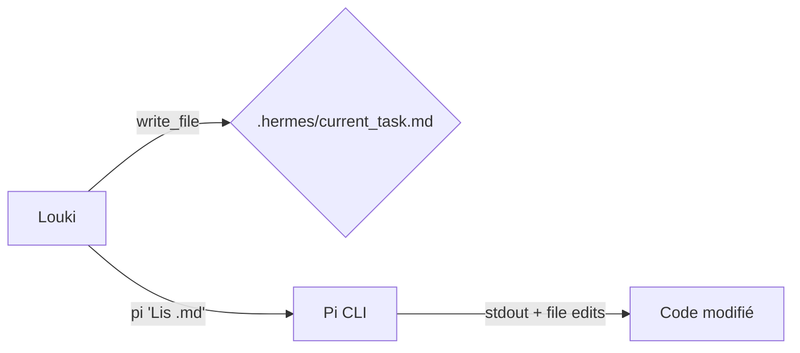

# Hermes ↔ Pi — Guide de délégation

**Projet : SurenSaaS**  
**Date : 04/05/2026**

Ce document décrit comment Hermes (Louki) délègue des tâches de code à Pi (pi.dev) via le **Bridge Markdown**, et pourquoi l'approche ACP/RPC a été abandonnée.

---

## Stratégie recommandée : Bridge Markdown



### Workflow

1. **Hermes génère** un fichier `.hermes/current_task.md` avec :
   - Objectif (1 phrase)
   - Contexte (erreurs, extraits de code avec numéros de ligne)
   - Fichiers à modifier (chemins absolus)
   - Contraintes (conventions, pas de nouvelles déps)
   - Résultat attendu

2. **Pi exécute** :
   ```bash
   cd /opt/projects/suren/saas/surenSaas/surenSaasBack
   timeout 90 pi "Lis .hermes/current_task.md et exécute la tâche." --no-session 2>&1 | tee .hermes/pi_output.txt
   ```

3. **Hermes review** la sortie et applique les changements.

4. **Hermes archive** la tâche :
   ```bash
   mv .hermes/current_task.md .hermes/tasks/task_<NAME>_<DATE>.md
   ```

### Règles du fichier `.md`

- **MAX 80 lignes / 3KB** (Pi lit tout le fichier dans son contexte)
- Chemins absolus du VPS : `/opt/projects/suren/saas/surenSaas/surenSaasBack/...`
- Extraits de code avec numéros de ligne
- Erreurs exactes (copier-coller de pytest ou logs)
- Dire explicitement ce que Pi doit retourner

### Contraintes projet à inclure

- Convention DB : `statut` jamais `status`
- Convention noms : `chantier_id` jamais `site_id`
- Toujours `org_id` dans les queries
- Pas de nouvelles dépendances pip
- Logging préfixé `[NOM_MODULE]`

---

## Pourquoi pas ACP/RPC ?

L'adaptateur `pi-acp` (v0.0.26) a été testé et abandonné pour les raisons suivantes :

| Aspect | ACP/RPC | Bridge Markdown |
|--------|---------|-----------------|
| Latence `session/new` | ~7s | 0 (pas de session) |
| Latence `session/prompt` | ~180s | ~10-30s |
| Processus | 2 subprocess (pi-acp → Pi RPC) | 1 subprocess direct |
| Traçabilité | NDJSON binaire → boîte noire | Fichier `.md` + log texte |
| Survie aux timeouts | Session perdue | Output sur disque |
| Complexité protocole | Initialize + auth + 3 handshakes | Un `read` de fichier |
| Provider | DeepSeek uniquement | Tous providers (dont Gemini) |

### Quand même utiliser ACP ?

- **IDE externe** : VS Code, Zed, JetBrains (client ACP natif)
- **Multi-agent streaming** : besoin de voir Pi penser en temps réel
- Dans notre cas : Hermes est le seul orchestrateur → Bridge suffit

---

## Architecture technique

```
Hermes (Louki)
  └─ write_file → .hermes/current_task.md
  └─ terminal → pi "Lis..." --no-session
       └─ Pi lit le fichier
       └─ Pi utilise ses outils (read, edit, bash, write)
       └─ Pi modifie les fichiers directement
       └─ Pi écrit sa réponse sur stdout
  └─ patch → applique les diffs si besoin
  └─ mv → archive la tâche
```

### Fichiers clés

| Fichier | Rôle |
|---------|------|
| `surenSaasBack/.hermes/current_task.md` | Tâche active (généré par Hermes, lu par Pi) |
| `surenSaasBack/.hermes/pi_output.txt` | Dernière réponse de Pi |
| `surenSaasBack/.hermes/tasks/` | Archive des tâches terminées |
| `~/.pi/agent/auth.json` | Clé API DeepSeek de Pi |
| `~/.pi/agent/AGENTS.md` | Contexte projet pour Pi |

---

## Troubleshooting

**Pi ne répond pas ou timeout :**
```bash
# Vérifier la clé
pi "test" --no-session

# Vérifier que le fichier .md existe et est lisible
cat .hermes/current_task.md | head -5

# Provider saturé → attendre 30s et réessayer
```

**Pi retourne du texte mais pas de code :**
- Le fichier `.md` est trop long → réduire à <80 lignes
- Provider DeepSeek a des rate limits → réessayer avec un prompt plus court

**Pi modifie les mauvais fichiers :**
- Toujours utiliser des chemins absolus dans le `.md`
- Préciser "Ne PAS créer de nouveaux fichiers" si applicable
